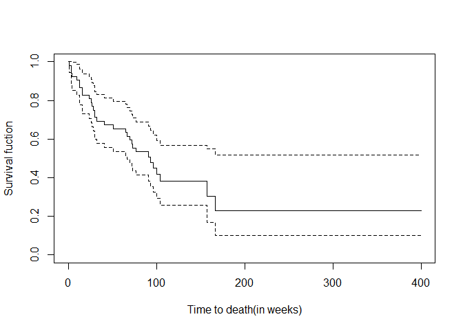

03-05 HW2 Solution
================
lhchien
2024-03-14

#### *Consider the study of the effect of ploidy on the survival of patients with cancer of the tongue. Using the data on aneuploid tumors.*

#### *(a) Estimate the survival function. Use the KM estimator.*

讀入資料

``` r
#install.packages("KMsurv") #安裝套件
library(KMsurv)
data(tongue)
```

從中挑選出 aneuploid tumors 的病人

``` r
tongue.1<-tongue[tongue$type==1,]
```

利用 *survfit* 指令得到 KM estimator

``` r
library(survival)

r.km<-survfit(Surv(time,delta)~1,data=tongue.1)
summary(r.km)
```

    ## Call: survfit(formula = Surv(time, delta) ~ 1, data = tongue.1)
    ## 
    ##  time n.risk n.event survival std.err lower 95% CI upper 95% CI
    ##     1     52       1    0.981  0.0190        0.944        1.000
    ##     3     51       2    0.942  0.0323        0.881        1.000
    ##     4     49       1    0.923  0.0370        0.853        0.998
    ##    10     48       1    0.904  0.0409        0.827        0.988
    ##    13     47       2    0.865  0.0473        0.777        0.963
    ##    16     45       2    0.827  0.0525        0.730        0.936
    ##    24     43       1    0.808  0.0547        0.707        0.922
    ##    26     42       1    0.788  0.0566        0.685        0.908
    ##    27     41       1    0.769  0.0584        0.663        0.893
    ##    28     40       1    0.750  0.0600        0.641        0.877
    ##    30     39       2    0.712  0.0628        0.598        0.846
    ##    32     37       1    0.692  0.0640        0.578        0.830
    ##    41     36       1    0.673  0.0651        0.557        0.813
    ##    51     35       1    0.654  0.0660        0.537        0.797
    ##    65     33       1    0.634  0.0669        0.516        0.780
    ##    67     32       1    0.614  0.0677        0.495        0.762
    ##    70     31       1    0.594  0.0683        0.475        0.745
    ##    72     30       1    0.575  0.0689        0.454        0.727
    ##    73     29       1    0.555  0.0693        0.434        0.709
    ##    77     27       1    0.534  0.0697        0.414        0.690
    ##    91     19       1    0.506  0.0715        0.384        0.667
    ##    93     18       1    0.478  0.0728        0.355        0.644
    ##    96     16       1    0.448  0.0741        0.324        0.620
    ##   100     14       1    0.416  0.0754        0.292        0.594
    ##   104     12       1    0.381  0.0767        0.257        0.566
    ##   157      5       1    0.305  0.0918        0.169        0.550
    ##   167      4       1    0.229  0.0954        0.101        0.518

根據 time 及 survival 欄位，可得到 survival function 的 KM estimator
(S(t)) 為

| index | time interval | S(t)  |
|:-----:|:-------------:|:-----:|
|   1   |   0\<=t\<1    | 1.000 |
|   2   |   1\<=t\<3    | 0.981 |
|   3   |   3\<=t\<4    | 0.942 |
|   4   |   4\<=t\<10   | 0.923 |
|   5   |  10\<=t\<13   | 0.904 |
|   6   |  13\<=t\<16   | 0.865 |
|   7   |  16\<=t\<24   | 0.827 |
|   8   |  24\<=t\<26   | 0.808 |
|   9   |  26\<=t\<27   | 0.788 |
|  10   |  27\<=t\<28   | 0.769 |
|  11   |  28\<=t\<30   | 0.750 |
|  12   |  30\<=t\<32   | 0.712 |
|  13   |  32\<=t\<41   | 0.692 |
|  14   |  41\<=t\<51   | 0.673 |
|  15   |  51\<=t\<65   | 0.654 |
|  16   |  65\<=t\<67   | 0.634 |
|  17   |  67\<=t\<70   | 0.614 |
|  18   |  70\<=t\<72   | 0.594 |
|  19   |  72\<=t\<73   | 0.575 |
|  20   |  73\<=t\<77   | 0.555 |
|  21   |  77\<=t\<91   | 0.534 |
|  22   |  91\<=t\<93   | 0.506 |
|  23   |  93\<=t\<96   | 0.478 |
|  24   |  96\<=t\<100  | 0.448 |
|  25   | 100\<=t\<104  | 0.416 |
|  26   | 104\<=t\<157  | 0.381 |
|  27   | 157\<=t\<167  | 0.305 |
|  28   | 167\<=t\<400  | 0.229 |

#### *(b) plot the estimated survival curve.*

``` r
plot(r.km, xlab = "Time to death(in weeks)",ylab = "Survival fuction")
```

<!-- -->

#### *(c) Estimate the survival function at 12 weeks and 60 weeks after transplant. Find the standard errors for your estimates.*

``` r
#S(12)
summary(r.km,12)
```

    ## Call: survfit(formula = Surv(time, delta) ~ 1, data = tongue.1)
    ## 
    ##  time n.risk n.event survival std.err lower 95% CI upper 95% CI
    ##    12     47       5    0.904  0.0409        0.827        0.988

``` r
#round(summary(r.km)$surv[sum(summary(r.km)$time<=12)],digits=3)
#round(summary(r.km)$std.err[sum(summary(r.km)$time<=12)],digits=3)

#S(60)
summary(r.km,60)
```

    ## Call: survfit(formula = Surv(time, delta) ~ 1, data = tongue.1)
    ## 
    ##  time n.risk n.event survival std.err lower 95% CI upper 95% CI
    ##    60     34      18    0.654   0.066        0.537        0.797

``` r
#round(summary(r.km)$surv[sum(summary(r.km)$time<=60)],digits=3)
#round(summary(r.km)$std.err[sum(summary(r.km)$time<=60)],digits=3)
```

$\hat{S}(12) = 0.904$, standard error $se(\hat{S}(12)) = 0.041$

$\hat{S}(60) = 0.654$, standard error $se(\hat{S}(60)) = 0.066$
