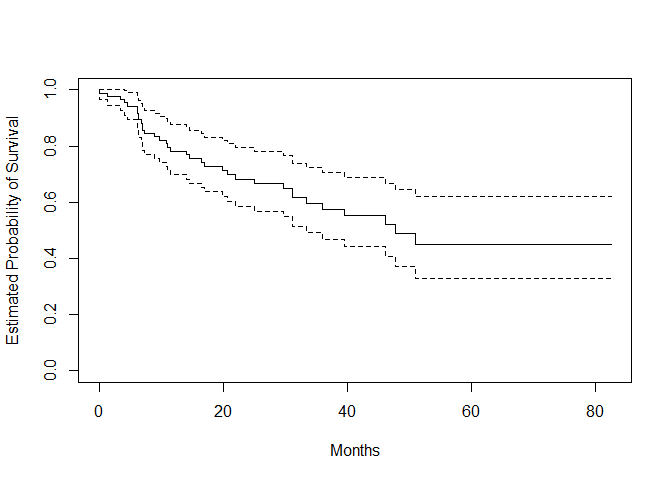
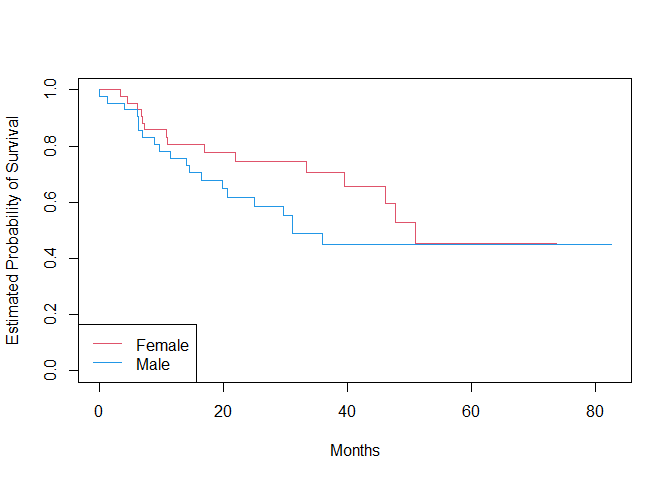
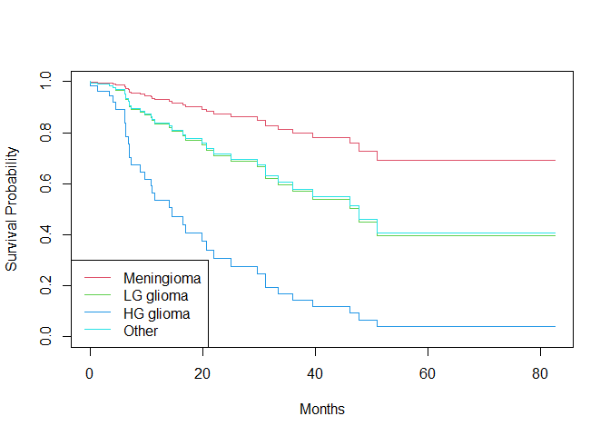
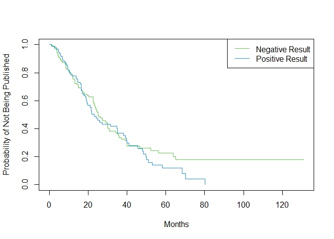
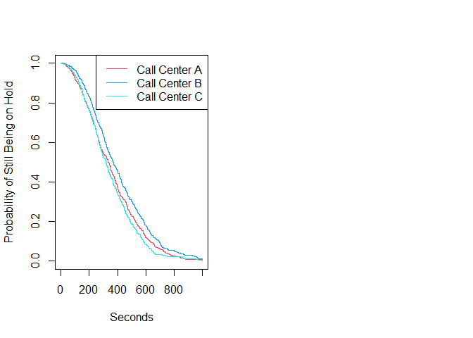
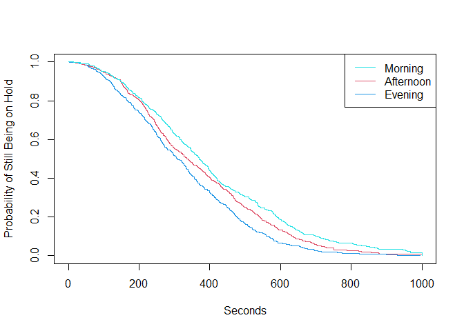

Lab: Survival Analysis
================
2024-05-07

# Lab: Survival Analysis

## Brain Cancer Data

``` r
library(ISLR2)
```

    ## Warning: 套件 'ISLR2' 是用 R 版本 4.3.2 來建造的

``` r
names(BrainCancer)
```

    ## [1] "sex"       "diagnosis" "loc"       "ki"        "gtv"       "stereo"   
    ## [7] "status"    "time"

``` r
attach(BrainCancer)
table(sex)
```

    ## sex
    ## Female   Male 
    ##     45     43

``` r
table(diagnosis)
```

    ## diagnosis
    ## Meningioma  LG glioma  HG glioma      Other 
    ##         42          9         22         14

``` r
table(status)
```

    ## status
    ##  0  1 
    ## 53 35

Kaplan-Meier survival curve

``` r
library(survival)
fit.surv <- survfit(Surv(time, status) ~ 1)
plot(fit.surv, xlab = "Months",
     ylab = "Estimated Probability of Survival")
```

<!-- -->

### Log-rank test

``` r
fit.sex <- survfit(Surv(time, status) ~ sex)
plot(fit.sex, xlab = "Months",
     ylab = "Estimated Probability of Survival", col = c(2,4))
legend("bottomleft", levels(sex), col = c(2,4), lty = 1)
```

<!-- -->

``` r
logrank.test <- survdiff(Surv(time, status) ~ sex)
logrank.test
```

    ## Call:
    ## survdiff(formula = Surv(time, status) ~ sex)
    ## 
    ##             N Observed Expected (O-E)^2/E (O-E)^2/V
    ## sex=Female 45       15     18.5     0.676      1.44
    ## sex=Male   43       20     16.5     0.761      1.44
    ## 
    ##  Chisq= 1.4  on 1 degrees of freedom, p= 0.2

### Cox proportional hazards model

``` r
fit.cox <- coxph(Surv(time, status) ~ sex)
summary(fit.cox)
```

    ## Call:
    ## coxph(formula = Surv(time, status) ~ sex)
    ## 
    ##   n= 88, number of events= 35 
    ## 
    ##           coef exp(coef) se(coef)     z Pr(>|z|)
    ## sexMale 0.4077    1.5033   0.3420 1.192    0.233
    ## 
    ##         exp(coef) exp(-coef) lower .95 upper .95
    ## sexMale     1.503     0.6652     0.769     2.939
    ## 
    ## Concordance= 0.565  (se = 0.045 )
    ## Likelihood ratio test= 1.44  on 1 df,   p=0.2
    ## Wald test            = 1.42  on 1 df,   p=0.2
    ## Score (logrank) test = 1.44  on 1 df,   p=0.2

``` r
summary(fit.cox)$logtest[1]
```

    ##     test 
    ## 1.438822

``` r
summary(fit.cox)$waldtest[1]
```

    ## test 
    ## 1.42

``` r
summary(fit.cox)$sctest[1] #the same as the log-rank test
```

    ##     test 
    ## 1.440495

``` r
logrank.test$chisq
```

    ## [1] 1.440495

``` r
fit.all <- coxph(
  Surv(time, status) ~ sex + diagnosis + loc + ki + gtv +
    stereo)
fit.all
```

    ## Call:
    ## coxph(formula = Surv(time, status) ~ sex + diagnosis + loc + 
    ##     ki + gtv + stereo)
    ## 
    ##                        coef exp(coef) se(coef)      z        p
    ## sexMale             0.18375   1.20171  0.36036  0.510  0.61012
    ## diagnosisLG glioma  0.91502   2.49683  0.63816  1.434  0.15161
    ## diagnosisHG glioma  2.15457   8.62414  0.45052  4.782 1.73e-06
    ## diagnosisOther      0.88570   2.42467  0.65787  1.346  0.17821
    ## locSupratentorial   0.44119   1.55456  0.70367  0.627  0.53066
    ## ki                 -0.05496   0.94653  0.01831 -3.001  0.00269
    ## gtv                 0.03429   1.03489  0.02233  1.536  0.12466
    ## stereoSRT           0.17778   1.19456  0.60158  0.296  0.76760
    ## 
    ## Likelihood ratio test=41.37  on 8 df, p=1.776e-06
    ## n= 87, number of events= 35 
    ##    (因為不存在，1 個觀察量被刪除了)

``` r
modaldata <- data.frame(
  diagnosis = levels(diagnosis),
  sex = rep("Female", 4),
  loc = rep("Supratentorial", 4),
  ki = rep(mean(ki), 4),
  gtv = rep(mean(gtv), 4),
  stereo = rep("SRT", 4)
)
modaldata
```

    ##    diagnosis    sex            loc       ki      gtv stereo
    ## 1 Meningioma Female Supratentorial 81.02273 8.660795    SRT
    ## 2  LG glioma Female Supratentorial 81.02273 8.660795    SRT
    ## 3  HG glioma Female Supratentorial 81.02273 8.660795    SRT
    ## 4      Other Female Supratentorial 81.02273 8.660795    SRT

``` r
survplots <- survfit(fit.all, newdata = modaldata)
plot(survplots, xlab = "Months",
     ylab = "Survival Probability", col = 2:5)
legend("bottomleft", levels(diagnosis), col = 2:5, lty = 1)
```

<!-- -->

## Publication Data

The outcome: time until publication.

Particular interest: whether or not the study/trial had a positive
result, versus a null result, whether that led to faster publication.

KM survival curve: negative result tend not to get published in the
slightly longer time

``` r
fit.posres <- survfit(
  Surv(time, status) ~ posres, data = Publication
)
plot(fit.posres, xlab = "Months",
     ylab = "Probability of Not Being Published", col = 3:4)
legend("topright", c("Negative Result", "Positive Result"),
       col = 3:4, lty = 1)
```

<!-- -->

Fit PHM

``` r
fit.pub <- coxph(Surv(time, status) ~ posres,
                 data = Publication)
fit.pub
```

    ## Call:
    ## coxph(formula = Surv(time, status) ~ posres, data = Publication)
    ## 
    ##          coef exp(coef) se(coef)     z    p
    ## posres 0.1481    1.1596   0.1616 0.916 0.36
    ## 
    ## Likelihood ratio test=0.83  on 1 df, p=0.3611
    ## n= 244, number of events= 156

``` r
logrank.test <- survdiff(Surv(time, status) ~ posres,
                         data = Publication)
logrank.test
```

    ## Call:
    ## survdiff(formula = Surv(time, status) ~ posres, data = Publication)
    ## 
    ##            N Observed Expected (O-E)^2/E (O-E)^2/V
    ## posres=0 146       87     92.6     0.341     0.844
    ## posres=1  98       69     63.4     0.498     0.844
    ## 
    ##  Chisq= 0.8  on 1 degrees of freedom, p= 0.4

``` r
fit.pub2 <- coxph(Surv(time, status) ~ . - mech,
                  data = Publication)
fit.pub2
```

    ## Call:
    ## coxph(formula = Surv(time, status) ~ . - mech, data = Publication)
    ## 
    ##                coef  exp(coef)   se(coef)      z       p
    ## posres    5.708e-01  1.770e+00  1.760e-01  3.244 0.00118
    ## multi    -4.086e-02  9.600e-01  2.512e-01 -0.163 0.87079
    ## clinend   5.462e-01  1.727e+00  2.620e-01  2.085 0.03710
    ## sampsize  4.678e-06  1.000e+00  1.472e-05  0.318 0.75070
    ## budget    4.385e-03  1.004e+00  2.465e-03  1.779 0.07518
    ## impact    5.832e-02  1.060e+00  6.676e-03  8.735 < 2e-16
    ## 
    ## Likelihood ratio test=149.2  on 6 df, p=< 2.2e-16
    ## n= 244, number of events= 156

posres become significant.

## Call Center Data

Simulate survival data

survival time: wait times (in seconds) for 2000 customers who have
phoned a call center

censoring: occurs if a customer hangs up before his or her call is
answered

``` r
set.seed(4)
N <- 2000
Operators <- sample(5:15, N, replace = T)
Center <- sample(c("A", "B", "C"), N, replace = T)
Time <- sample(c("Morn.", "After.", "Even."), N, replace = T)
X <- model.matrix( ~ Operators + Center + Time)[, -1]
```

``` r
X[1:5, ]
```

    ##   Operators CenterB CenterC TimeEven. TimeMorn.
    ## 1        12       1       0         0         1
    ## 2        15       0       0         0         0
    ## 3         7       0       1         1         0
    ## 4         7       0       0         0         0
    ## 5        11       0       1         0         1

set the true coefficients

``` r
true.beta <- c(0.04, -0.3, 0, 0.2, -0.2)
h.fn <- function(x) return(0.00001 * x)
```

``` r
library(coxed)
```

    ## Warning: 套件 'coxed' 是用 R 版本 4.3.3 來建造的

    ## 載入需要的套件：rms

    ## Warning: 套件 'rms' 是用 R 版本 4.3.3 來建造的

    ## 載入需要的套件：Hmisc

    ## Warning: 套件 'Hmisc' 是用 R 版本 4.3.2 來建造的

    ## 
    ## 載入套件：'Hmisc'

    ## 下列物件被遮斷自 'package:base':
    ## 
    ##     format.pval, units

    ## 載入需要的套件：mgcv

    ## 載入需要的套件：nlme

    ## This is mgcv 1.8-42. For overview type 'help("mgcv-package")'.

``` r
queuing <- sim.survdata(N = N, T = 1000, X = X,
                        beta = true.beta, hazard.fun = h.fn)
```

    ## Warning in FUN(X[[i]], ...): 9 additional observations right-censored because the user-supplied hazard function
    ##                                   is nonzero at the latest timepoint. To avoid these extra censored observations, increase T

``` r
names(queuing)
```

    ## [1] "data"             "xdata"            "baseline"         "xb"              
    ## [5] "exp.xb"           "betas"            "ind.survive"      "marg.effect"     
    ## [9] "marg.effect.data"

``` r
head(queuing$data)
```

    ##   Operators CenterB CenterC TimeEven. TimeMorn.   y failed
    ## 1        12       1       0         0         1 344   TRUE
    ## 2        15       0       0         0         0 241   TRUE
    ## 3         7       0       1         1         0 187   TRUE
    ## 4         7       0       0         0         0 279   TRUE
    ## 5        11       0       1         0         1 954   TRUE
    ## 6         7       1       0         0         1 455   TRUE

``` r
mean(queuing$data$failed)
```

    ## [1] 0.89

``` r
par(mfrow = c(1, 2))
fit.Center <- survfit(Surv(y, failed) ~ Center,
                      data = queuing$data)
plot(fit.Center, xlab = "Seconds",
     ylab = "Probability of Still Being on Hold",
     col = c(2, 4, 5))
legend("topright",
       c("Call Center A", "Call Center B", "Call Center C"),
       col = c(2, 4, 5), lty = 1)
```

<!-- -->

``` r
fit.Time <- survfit(Surv(y, failed) ~ Time,
                    data = queuing$data)
plot(fit.Time, xlab = "Seconds",
     ylab = "Probability of Still Being on Hold",
     col = c(2, 4, 5))
legend("topright", c("Morning", "Afternoon", "Evening"),
       col = c(5, 2, 4), lty = 1)
```

<!-- -->

``` r
survdiff(Surv(y, failed) ~ Center, data = queuing$data)
```

    ## Call:
    ## survdiff(formula = Surv(y, failed) ~ Center, data = queuing$data)
    ## 
    ##            N Observed Expected (O-E)^2/E (O-E)^2/V
    ## Center=A 683      603      579     0.971      1.45
    ## Center=B 667      600      701    14.641     24.64
    ## Center=C 650      577      499    12.062     17.05
    ## 
    ##  Chisq= 28.3  on 2 degrees of freedom, p= 7e-07

``` r
survdiff(Surv(y, failed) ~ Time, data = queuing$data)
```

    ## Call:
    ## survdiff(formula = Surv(y, failed) ~ Time, data = queuing$data)
    ## 
    ##               N Observed Expected (O-E)^2/E (O-E)^2/V
    ## Time=After. 688      616      619    0.0135     0.021
    ## Time=Even.  653      582      468   27.6353    38.353
    ## Time=Morn.  659      582      693   17.7381    29.893
    ## 
    ##  Chisq= 46.8  on 2 degrees of freedom, p= 7e-11

``` r
fit.queuing <- coxph(Surv(y, failed) ~ .,
                     data = queuing$data)
fit.queuing
```

    ## Call:
    ## coxph(formula = Surv(y, failed) ~ ., data = queuing$data)
    ## 
    ##               coef exp(coef) se(coef)      z        p
    ## Operators  0.04174   1.04263  0.00759  5.500  3.8e-08
    ## CenterB   -0.21879   0.80349  0.05793 -3.777 0.000159
    ## CenterC    0.07930   1.08253  0.05850  1.356 0.175256
    ## TimeEven.  0.20904   1.23249  0.05820  3.592 0.000328
    ## TimeMorn. -0.17352   0.84070  0.05811 -2.986 0.002828
    ## 
    ## Likelihood ratio test=102.8  on 5 df, p=< 2.2e-16
    ## n= 2000, number of events= 1780
