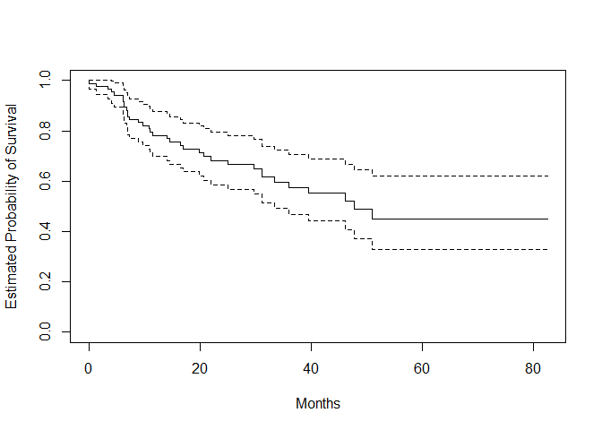
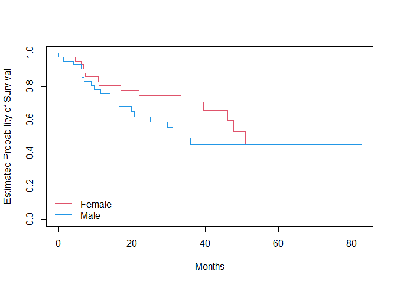

Cox Proportional hazards model
================
2024-04-09

``` r
library(ISLR2)
```

    ## Warning: 套件 'ISLR2' 是用 R 版本 4.3.2 來建造的

``` r
head(BrainCancer)
```

    ##      sex  diagnosis            loc ki   gtv stereo status  time
    ## 1 Female Meningioma Infratentorial 90  6.11    SRS      0 57.64
    ## 2   Male  HG glioma Supratentorial 90 19.35    SRT      1  8.98
    ## 3 Female Meningioma Infratentorial 70  7.95    SRS      0 26.46
    ## 4 Female  LG glioma Supratentorial 80  7.61    SRT      1 47.80
    ## 5   Male  HG glioma Supratentorial 90  5.06    SRT      1  6.30
    ## 6 Female Meningioma Supratentorial 80  4.82    SRS      0 52.75

``` r
#?BrainCancer

attach(BrainCancer)
```

``` r
library(survival)

fit.surv<-survfit(Surv(time,status)~1)
plot(fit.surv,xlab="Months",ylab="Estimated Probability of Survival")
```

<!-- -->

``` r
fit.sex <- survfit(Surv(time, status) ~ sex)
plot(fit.sex , xlab = "Months", ylab = "Estimated Probability of Survival", col = c(2,4))
legend("bottomleft", levels(sex), col = c(2,4), lty = 1)
```

<!-- -->

``` r
fit.cox <- coxph(Surv(time, status) ~ sex)
summary(fit.cox)
```

    ## Call:
    ## coxph(formula = Surv(time, status) ~ sex)
    ## 
    ##   n= 88, number of events= 35 
    ## 
    ##           coef exp(coef) se(coef)     z Pr(>|z|)
    ## sexMale 0.4077    1.5033   0.3420 1.192    0.233
    ## 
    ##         exp(coef) exp(-coef) lower .95 upper .95
    ## sexMale     1.503     0.6652     0.769     2.939
    ## 
    ## Concordance= 0.565  (se = 0.045 )
    ## Likelihood ratio test= 1.44  on 1 df,   p=0.2
    ## Wald test            = 1.42  on 1 df,   p=0.2
    ## Score (logrank) test = 1.44  on 1 df,   p=0.2

``` r
fit.all <- coxph(Surv(time, status) ~ sex + diagnosis + loc + ki + gtv + stereo)
summary(fit.all)
```

    ## Call:
    ## coxph(formula = Surv(time, status) ~ sex + diagnosis + loc + 
    ##     ki + gtv + stereo)
    ## 
    ##   n= 87, number of events= 35 
    ##    (因為不存在，1 個觀察量被刪除了)
    ## 
    ##                        coef exp(coef) se(coef)      z Pr(>|z|)    
    ## sexMale             0.18375   1.20171  0.36036  0.510  0.61012    
    ## diagnosisLG glioma  0.91502   2.49683  0.63816  1.434  0.15161    
    ## diagnosisHG glioma  2.15457   8.62414  0.45052  4.782 1.73e-06 ***
    ## diagnosisOther      0.88570   2.42467  0.65787  1.346  0.17821    
    ## locSupratentorial   0.44119   1.55456  0.70367  0.627  0.53066    
    ## ki                 -0.05496   0.94653  0.01831 -3.001  0.00269 ** 
    ## gtv                 0.03429   1.03489  0.02233  1.536  0.12466    
    ## stereoSRT           0.17778   1.19456  0.60158  0.296  0.76760    
    ## ---
    ## Signif. codes:  0 '***' 0.001 '**' 0.01 '*' 0.05 '.' 0.1 ' ' 1
    ## 
    ##                    exp(coef) exp(-coef) lower .95 upper .95
    ## sexMale               1.2017     0.8321    0.5930    2.4352
    ## diagnosisLG glioma    2.4968     0.4005    0.7148    8.7215
    ## diagnosisHG glioma    8.6241     0.1160    3.5664   20.8546
    ## diagnosisOther        2.4247     0.4124    0.6678    8.8031
    ## locSupratentorial     1.5546     0.6433    0.3914    6.1741
    ## ki                    0.9465     1.0565    0.9132    0.9811
    ## gtv                   1.0349     0.9663    0.9906    1.0812
    ## stereoSRT             1.1946     0.8371    0.3674    3.8839
    ## 
    ## Concordance= 0.794  (se = 0.04 )
    ## Likelihood ratio test= 41.37  on 8 df,   p=2e-06
    ## Wald test            = 38.7  on 8 df,   p=6e-06
    ## Score (logrank) test = 46.59  on 8 df,   p=2e-07

The diagnosis variable has been coded so that the baseline corresponds
to meningioma. The results indicate that the risk associated with HG
glioma is more than eight times (i.e. $e^{2.15}= 8.62$) the risk
associated with meningioma.

$$ \text{relative risk (Hazard ratio)} = \frac{Pr(Death|\text{HG glioma})}{Pr(Death|\text{Meningioma})}=e^{\hat{\beta}_{HG glioma}} = e^{2.15}= 8.62$$

In other words, after adjusting for the other predictors, patients with
HG glioma have much worse survival compared to those with meningioma. In
addition, larger values of the Karnofsky index, ki, are associated with
lower risk, i.e. longer survival.

HR(hazard ratio): in summary

- HR = 1: No effect

- HR \< 1: Reduction in the hazard

- HR \> 1: Increase in Hazard
