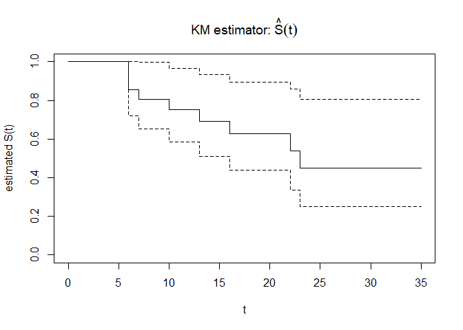

Ch4 KM estimator
================
Li-Hsin Chien
2024-03-03

# Kaplan-Meier(KM) estimator

KM estimator $\hat{S}(t)$ 用無母數的方式估計存活函數 $S(t)$。

``` r
library(KMsurv) #使用 KMsurv 套件裡的資料
data(drug6mp) #課本 Example 4.1
#?drug6mp
drug6mp
```

    ##    pair remstat t1 t2 relapse
    ## 1     1       1  1 10       1
    ## 2     2       2 22  7       1
    ## 3     3       2  3 32       0
    ## 4     4       2 12 23       1
    ## 5     5       2  8 22       1
    ## 6     6       1 17  6       1
    ## 7     7       2  2 16       1
    ## 8     8       2 11 34       0
    ## 9     9       2  8 32       0
    ## 10   10       2 12 25       0
    ## 11   11       2  2 11       0
    ## 12   12       1  5 20       0
    ## 13   13       2  4 19       0
    ## 14   14       2 15  6       1
    ## 15   15       2  8 17       0
    ## 16   16       1 23 35       0
    ## 17   17       1  5  6       1
    ## 18   18       2 11 13       1
    ## 19   19       2  4  9       0
    ## 20   20       2  1  6       0
    ## 21   21       2  8 10       0

*drug6mp* 的資料說明可以參考課本 Section 1.2。

我們要使用的資料為:

- *t2*: Time to relapse for 6-MP patients, months
  ($T$:觀測到的復發時間，包含 right censored data)

- *relapse*: Relapse indicator (0=censored, 1=relapse) for 6-MP patients
  ($\delta$)

計算 KM estimator 使用的指令為 survfit()，指令在 survival 套件中。

``` r
library(survival)
fit <- survfit(Surv(t2,relapse)~1, data=drug6mp)
summary(fit)
```

    ## Call: survfit(formula = Surv(t2, relapse) ~ 1, data = drug6mp)
    ## 
    ##  time n.risk n.event survival std.err lower 95% CI upper 95% CI
    ##     6     21       3    0.857  0.0764        0.720        1.000
    ##     7     17       1    0.807  0.0869        0.653        0.996
    ##    10     15       1    0.753  0.0963        0.586        0.968
    ##    13     12       1    0.690  0.1068        0.510        0.935
    ##    16     11       1    0.627  0.1141        0.439        0.896
    ##    22      7       1    0.538  0.1282        0.337        0.858
    ##    23      6       1    0.448  0.1346        0.249        0.807

- time: $t_i$, 發生 event 的時間點 (survival function jump 的時間點)。

- n.risk: $Y_i$, risk set 人數。在 $t_i^-$ 時還活著的人 (包含在 $t_i$
  發生 event 的人)。

- n.event: $d_i$, 在 $t_i$ 時間點發生 event 的人數。

- survival: $\hat{S}(t_i)$, KM estimator。

- std.err: $\hat{S}(t_i)$ 的 standard error。

- lower 95% CI: $\hat{S}(t_i)$ 95% 信賴區間下界。

- upper 95% CI: $\hat{S}(t_i)$ 95% 信賴區間上界。

畫出 $\hat{S}(t)$

``` r
plot(fit, xlab="t",ylab="estimated S(t)",main=expression(paste("KM estimator: ",hat(S)(t))))
```

<!-- -->
